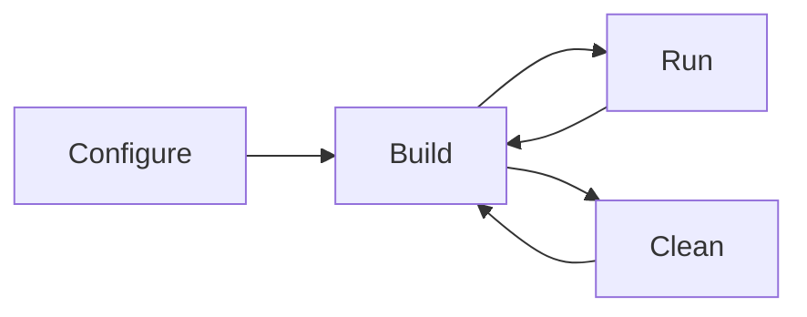

# Build

## Setup
Copy the `SDL.dll` to the source directory for the program to run successfully

## Configure & Build

Configure with cmake
```powershell
cmake -B build -S . -G Ninja -DSDL2_DIR="<path-to-sdl>"
```

Build with cmake
```powershell
cmake --build build
```

Clean with cmake
```powershell
cmake --build build --target clean
```

Run the app
```powershell
build/psychic-guacamole.exe 
```

Get changes
```powershell
git pull
```

Push changes
```powershell
git add <files-that-changed>
git commit . -m '<message about the commit>'
git push
```

Flow chart


Debug line
```powershell
addr2line -e build/psychic-guacamole.exe -a (number)
```
