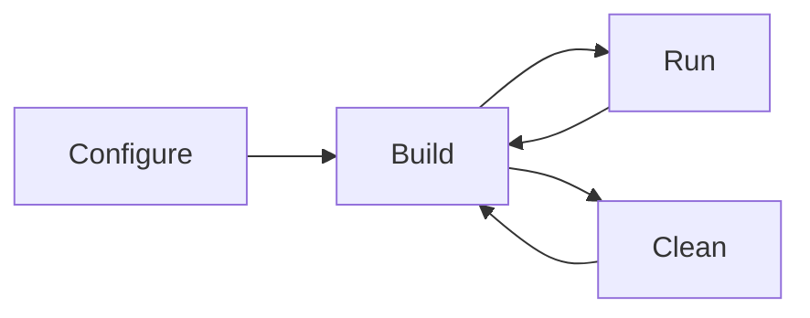

# Build

## Configure

Configure with cmake
```powershell
cmake -B build -S . -G Ninja -DSDL2_DIR="<path-to-sdl>"
```

Build with cmake
```powershell
cmake --build build
```

Clean with cmake
```powershell
cmake --build build --target clean
```

Run the app
```powershell
build/<app>.exe 
```

Flow chart

